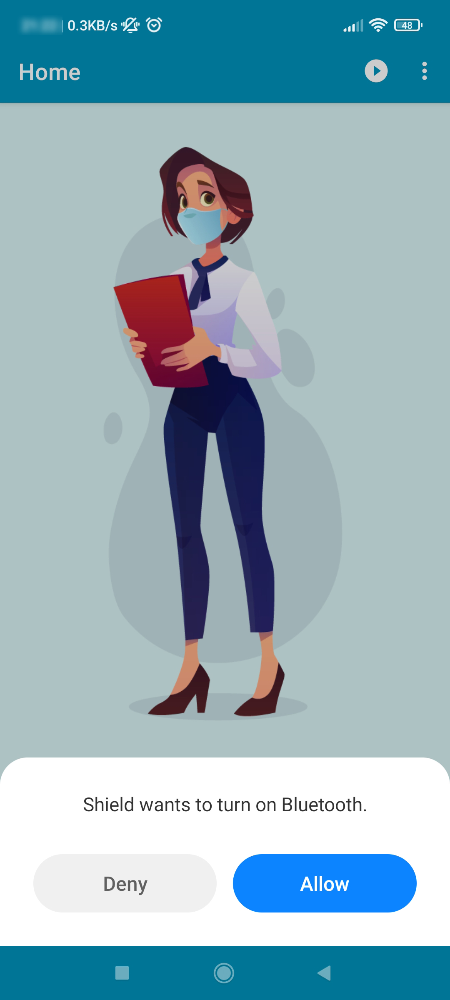
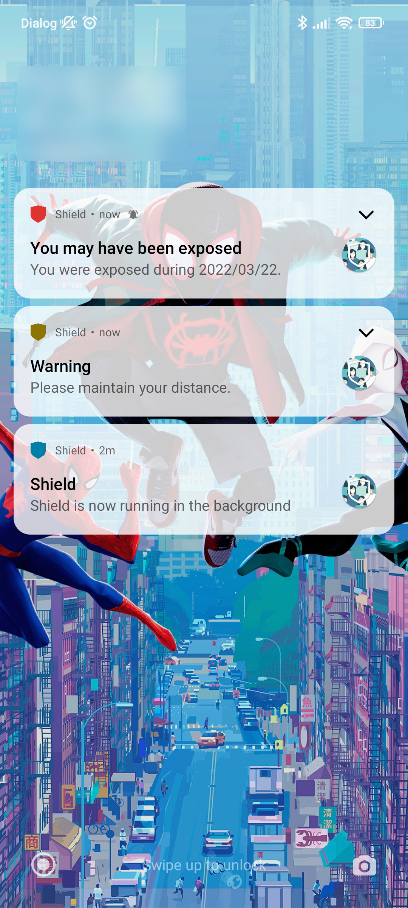
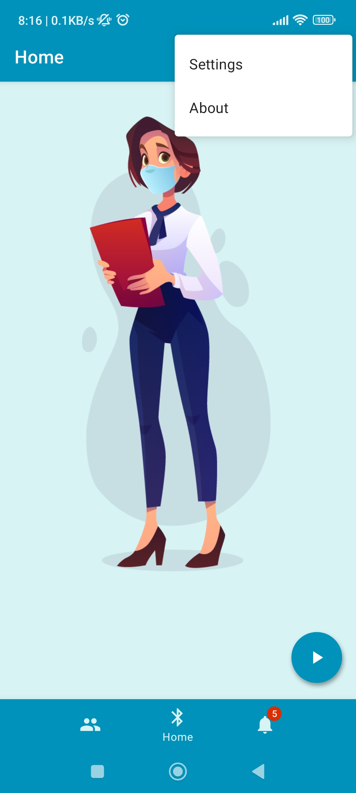

<!-- PROJECT LOGO -->
 

  

  <h3 align="center">🛡️Shield - Social Distance Reminder</h3>

  

    Shield is a Social Distancing Reminder app. The app will identify when another person (someone with a phone and the app) comes too close to you using BLE RSSI (Received Signal Strength Indicator). This will be useful in places such as universities and offices where everyone has a smartphone and will have the application installed.
     
    <a href="https://github.com/kavindaperera/nova-shield/tree/development/docs"><strong>Explore the docs »</strong></a>
     
     
    <a href="https://github.com/kavindaperera/nova-shield">View Demo</a>
    ·
    <a href="https://github.com/kavindaperera/nova-shield/issues">Report Bug</a>
    ·
    <a href="https://github.com/kavindaperera/nova-shield/issues">Request Feature</a>
  

<!-- ABOUT THE PROJECT -->
## Welcome to 🛡️Shield!

[![Shield Banner][product-banner]](https://github.com/kavindaperera/nova-shield)

(<a href="#top">back to top</a>)

<!-- HOW DOES IT WORK-->
## How does it work?

[![How][how-banner]](https://github.com/kavindaperera/nova-shield)

(<a href="#top">back to top</a>)

<!-- USER INTERFACE -->
## User Interface

### Onboarding

  
  
  

When a user first tries to install the Shield app, these 3 screens will appear in the shown order. 
The user can simply press the <strong>CONTINUE</strong> button on the first 2 screens and arrive at the Registration Screen.
The user can enter a nickname to be used within the app and simply press the <strong>REGISTER</strong>  button to complete the registration.

(<a href="#top">back to top</a>)

### Permissions

  
  
  

A user can start the Shield protection service by pressing the  button on the bottom right corner of the home screen. This will start a simple animation on the home screen which indicates that the Shield protection is ON. The user can leave the app after this and still the application will be running in the background.
If the user needs to stop the Shield protection, then he/she needs to press the  button. 

(<a href="#top">back to top</a>)

### Home

  
  

Shield app requires the users to grant location access permission. When the user first launches the app, a pop-up dialog box will appear as shown in the first figure. The user can then select the Yes option which will open the phone’s settings. Then user can grant the required permission as shown in the second figure. In order to run the app, it needs phone’s Bluetooth to be turned on. If Bluetooth is not on, then a pop-up dialog as shown in the third figure will appear.

(<a href="#top">back to top</a>)

### Notification Alerts

  
  

(<a href="#top">back to top</a>)

### Friend List

  
  
  
  

A user can access the Friends Screen by pressing the Friends Tab on the bottom navigation bar. 
By pressing the  button on the bottom right corner, a user can get the Scan QR Code & Display QR Code options. Using the Scan QR Code option, a user can scan the Shield QR Code of a close friend and add him/her to the whitelist. Using the Display QR Code option, a user can show his/her Shield QR Code to another person to scan.
Once a user has added some friends to the whitelist, a  button is shown at the bottom right corner if the user wants to remove someone from the whitelist.

(<a href="#top">back to top</a>)

### Settings

  
  

A user can access the menu which on the top right corner of home screen and go to the Settings Tab on that menu. It shows few options as shown in the figure here. By pressing the Mark as COVID-19 Infected option, a user can update the Firebase database so that other Shield users will get Exposed Notifications if they have been in contact with you within the last 7 days.  

(<a href="#top">back to top</a>)

<!-- PROXIMITY CLASSIFICATION -->
## Proximity Classification

Radio Signal Strength Indication (RSSI) obtained by Bluetooth Low Energy Signals is used to to estimate the proximity and duration of an user’s exposure to patients diagnosed with COVID-19.

<a href="https://github.com/kavindaperera/nova-shield-proximity-classification/tree/development/dataset">View RSSI Dataset</a>

<a href="https://github.com/kavindaperera/nova-shield-proximity-classification/blob/development/Sequential%20Model.ipynb">View Deep Learning Model</a>

(<a href="#top">back to top</a>)

<!-- MARKDOWN LINKS & IMAGES -->
[product-banner]: /docs/res/readme_banner.png
[how-banner]: docs/res/avatars/4x/UG1%404x.png
